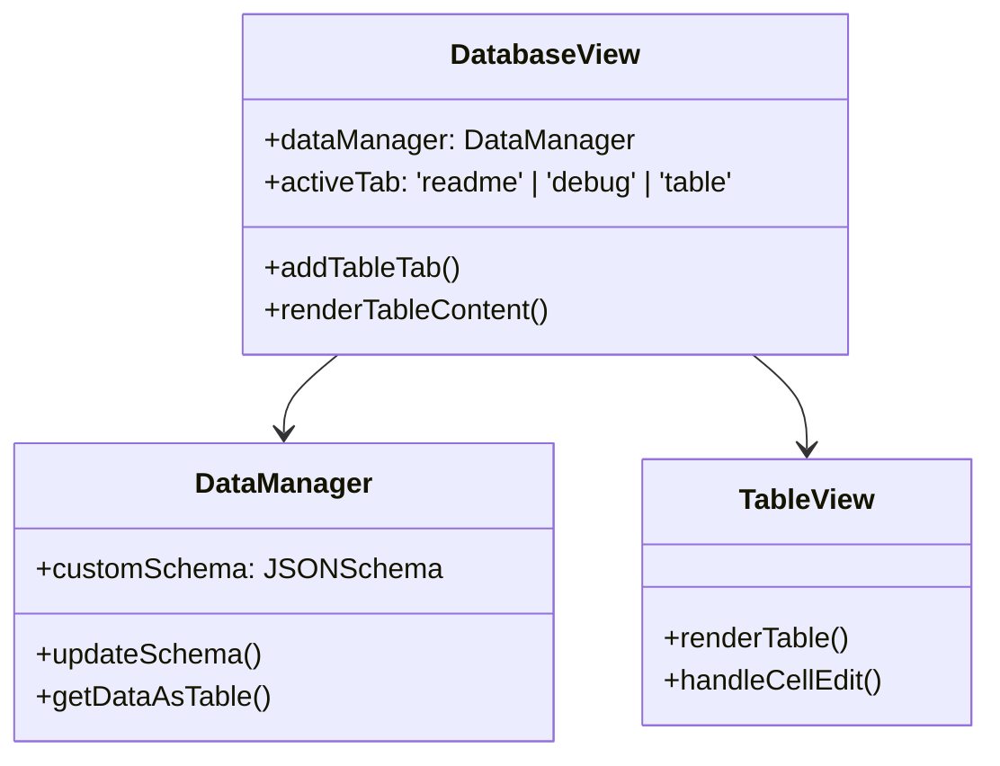

# 数据库视图增强计划

## 功能需求
1. 新增表格视图选项卡
2. 支持自定义JSON Schema
3. 增强调试视图显示完整JSON

## 技术方案

### 组件结构

### 实现步骤

1. 修改DatabaseView.ts:
   - 添加新的表格选项卡
   - 实现表格内容渲染方法

2. 创建TableView组件:
   - 基于ag-grid或类似库实现可编辑表格
   - 支持根据Schema动态生成列

3. 增强Debug组件:
   - 添加JSON树形查看器
   - 显示Schema验证错误

4. 修改DataManager:
   - 添加Schema存储和验证逻辑
   - 实现数据表格转换方法

## 开发顺序
1. 先实现表格视图基础功能
2. 添加Schema编辑器
3. 最后增强调试视图
